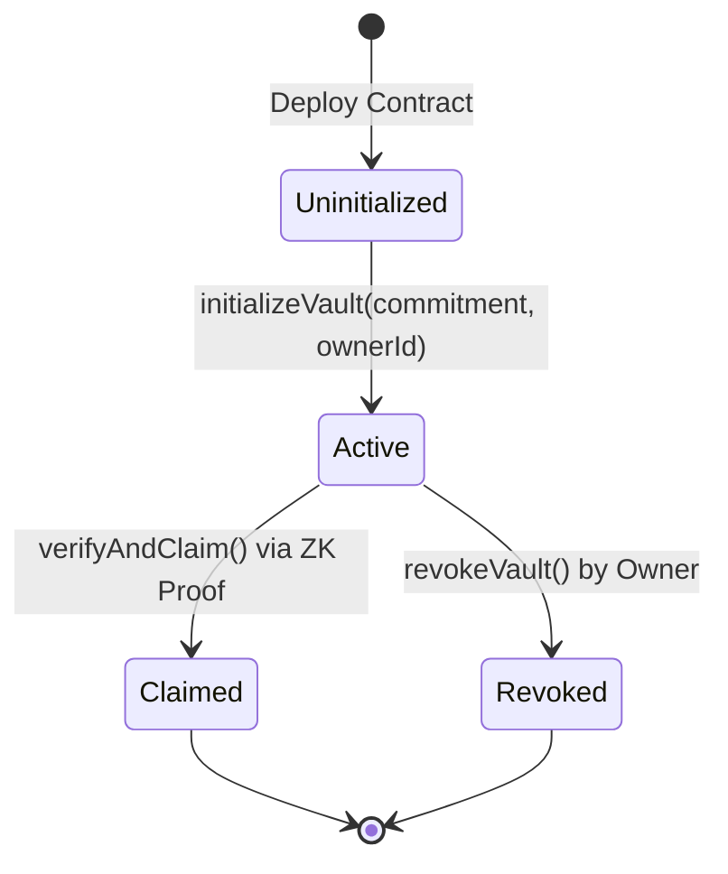

# 📜 Product Proposal: ShadowVault Sealed-Bid Auction & Confidential Escrow Protocol

> **Midnight Blockchain Level 3 Idea List Selection**: *Option 5 — Sealed-Bid Auction (Private bids, verifiable winner)*

---

## 🎯 Executive Overview

**ShadowVault Sealed-Bid Auction** is a privacy-preserving smart contract protocol built on the Midnight Blockchain. It enables high-value asset auctions, secret procurement bidding, and confidential escrows where bidders submit client-side zero-knowledge bid commitments. Bid amounts, bidder identities, and salt parameters remain 100% private during the bidding phase. When the auction closes, the winner proves their winning bid using client-side ZK proof generation without revealing losing bid values to public ledger observers.

---

## 🔍 Problem Statement & Market Need

### The Challenge on Public Blockchains
On public blockchains (Ethereum, Solana, Cardano), smart contract state is completely transparent. As a result:
1. **Front-Running & MEV Exploitation**: Malicious actors inspect pending mempool bids and outbid honest users by minimal increments.
2. **Bid Leakage**: Public visibility forces participants to reveal their true willingness-to-pay, distorting market efficiency.
3. **Shill Bidding**: Sellers can observe incoming bids and artificially drive prices up.

### The Midnight Solution
Using Midnight's **Compact smart contract language** and **hybrid zero-knowledge ledger state**:
- Bids are constructed off-chain as **Private Witnesses** (`secretWitness()`).
- Bidders post cryptographic commitment hashes (`disclose(hash)`) on-chain.
- The winning bidder proves compliance with auction rules via client-side zero-knowledge proofs without exposing losing bid data.

---

## 👤 Targeted User Personas

1. **Enterprise Procurement Managers**: Organizations soliciting sealed bids from vendors without exposing competitive pricing structures.
2. **Confidential Real-Estate & NFT Auctioneers**: Sellers auctioning high-value physical or digital property where bid privacy is legally required.
3. **DeFi Privacy Traders**: Liquidity providers settling secret OTC trades and batch auctions without MEV exposure.

---

## 🔐 Selective Disclosure & Privacy Architecture

| Data Component | Visibility | Execution Layer | Purpose |
| :--- | :--- | :--- | :--- |
| **Bid Amount & Passphrase** | 🔒 Private Witness | Client Browser | Stored in local memory; used to construct ZK proof. Never sent on-network. |
| **Bidder Salt (`userSalt`)** | 🔒 Private Witness | Client Browser | Prevents dictionary attacks on commitment hashes. |
| **Commitment Hash** | 📜 Public Ledger | Midnight Preprod | SHA-256 digest of secret bid posted during `initializeVault`. |
| **Auction State Enum** | 📜 Public Ledger | Midnight Preprod | State tracking (`uninitialized`, `active`, `claimed`, `revoked`). |
| **Winner Disclosure (`disclose()`)** | 📜 Public Ledger | Midnight Preprod | Explicit opt-in disclosure of winning commitment digest upon verified claim. |

---

## ⚙️ Contract State Machine & Circuit Workflow

### Circuit Interfaces (`src/shadow_vault.compact`)
1. `initializeVault(commitment: Bytes<32>, ownerId: Bytes<32>): []`  
   - Binds the sealed-bid commitment and transitions state to `active`.
2. `verifyAndClaim(): []`  
   - Verifies the private witness passphrase and salt off-chain, verifies commitment hash, and transitions state to `claimed`.
3. `revokeVault(): []`  
   - Cancels auction if conditions are unfulfilled.

---

## 🛡️ Privacy Model Summary

- **What an Observer CAN Learn**:
  - Total number of bids submitted (`totalDeposits`).
  - Public commitment hashes (`publicCommitment`).
  - Current auction state (`VaultState`).
  - Block timestamp and transaction IDs.
- **What an Observer CANNOT Learn**:
  - Raw secret bid amounts or passphrases.
  - Bidder wallet identity or salt keys.
  - Losing bid values or unrevealed private state.

---

## 🗺️ Product Roadmap

- [x] **Level 1 (New Moon)**: Toolchain installation, Compact contract creation, managed ZK circuit generation.
- [x] **Level 2 (Waxing Crescent)**: Lace Wallet DApp connector integration, Web UI implementation, observable privacy demo.
- [x] **Level 3 (First Quarter)**: CI/CD GitHub Actions pipeline, production build, formal product proposal.
- [ ] **Level 4 (Full Moon)**: Mainnet deployment, multi-bidder sealed auction aggregation, automated refund escrow.
