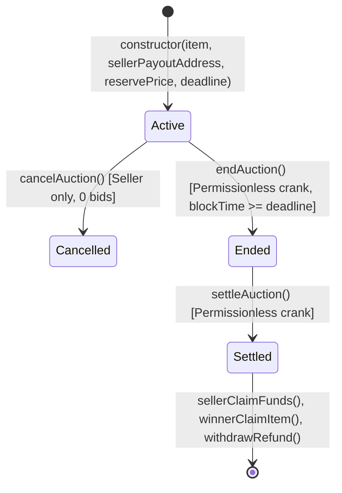

# 📜 Product Proposal: ShadowVault Open English Auction & Native Escrow Protocol

> **Midnight Blockchain Decentralized Auction & Escrow Protocol**: *Transparent English Auction with Native Token Escrow, Pull-over-Push Refunds, and Domain-Separated Zero-Knowledge Identity Verification.*

---

## 🎯 Executive Overview

**ShadowVault** is a decentralized smart contract protocol built on the Midnight Blockchain. It enables transparent, verifiable English auctions where bidders place on-chain bids backed by native token escrow locked directly in the smart contract. Outbid deposits accumulate in an on-chain escrow balance map (`pendingRefunds`) and can be withdrawn asynchronously by outbid bidders via pull-over-push accounting. Bidding deadlines are strictly governed by consensus block time, and finalization is executed via permissionless cranks.

---

## 🔍 Architecture & Economic Design

### 1. Transparent Bidding with Native Token Escrow
- Bids are placed openly on-chain: `placeBid(bidAmount, bidderRefundAddress)` requires `bidAmount >= reservePrice` and `bidAmount > highestBid`.
- Bid funds are locked into contract escrow via Midnight native token operations (`receiveUnshielded`).
- When a bidder is outbid, their deposit is accumulated into `pendingRefunds.lookup(prevBidder) + prevAmount`, ensuring solvency.

### 2. Consensus Block-Time Enforcement
- The auction deadline is enforced directly via Midnight Compact standard library time comparison functions (`blockTimeLt(deadline)` in `placeBid` and `blockTimeGte(deadline)` in `endAuction`).
- Manual round counters and arbitrary early-termination paths have been eliminated.

### 3. Permissionless State Machine & Settlement
- The lifecycle follows: `Active (0) -> Ended (1) -> Settled (2)` (or `Cancelled (3)` if seller cancels before any bids).
- `endAuction` and `settleAuction` are permissionless cranks callable by any participant once consensus time has elapsed.
- Settlement allows the seller to claim winning escrow funds (`sellerClaimFunds`) and the winner to claim the auction item entitlement (`winnerClaimItem`).

---

## 👤 Targeted User Personas

1. **Decentralized Asset Sellers**: Creators and asset holders requiring trustless escrow auctions without custodial intermediaries.
2. **On-Chain Auction Bidders**: Participants who need deterministic refund guarantees when outbid.
3. **Automated Protocol Keepers**: Cranks and bots that trigger state transitions once block-time deadlines pass.

---

## 🔐 Selective Disclosure & Privacy Architecture

| Data Component | Visibility | Execution Layer | Purpose |
| :--- | :--- | :--- | :--- |
| **Caller Secret (`secretKey`)** | 🔒 Private Witness | Client Memory | Private seed used to derive caller's public identity; never disclosed. |
| **Derived Identity** | 📜 Public Ledger | Midnight Preprod | Hash digest `persistentHash(["midnight.auction.identity", secretKey])` binding bidder/seller. |
| **Bid Amount & Item ID** | 📜 Public Ledger | Midnight Preprod | Public ledger state ensuring open auction price discovery. |
| **Auction State Enum** | 📜 Public Ledger | Midnight Preprod | Public lifecycle state (`Active = 0, Ended = 1, Settled = 2, Cancelled = 3`). |
| **Escrow Map (`pendingRefunds`)** | 📜 Public Ledger | Midnight Preprod | Maps bidder identity to accumulated refundable token amounts. |

---

## ⚙️ Contract State Machine & Circuit Workflow

```mermaid
stateDiagram-v2
    [*] --> Active: constructor(item, sellerPayoutAddress, reservePrice, deadline)
    Active --> Cancelled: cancelAuction() [Seller only, 0 bids]
    Active --> Ended: endAuction() [Permissionless crank, blockTime >= deadline]
    Ended --> Settled: settleAuction() [Permissionless crank]
    Settled --> [*]: sellerClaimFunds(), winnerClaimItem(), withdrawRefund()
```

### Circuit Interfaces (`contracts/shadow_vault.compact`)
1. `cancelAuction(): []` — Seller cancels auction if no bids have occurred.
2. `placeBid(bidAmount, bidderRefundAddress): []` — Places new highest bid, locks funds in escrow, accumulates previous bidder refund.
3. `endAuction(): []` — Closes bidding once consensus block time passes deadline.
4. `settleAuction(): []` — Finalizes winning bid.
5. `sellerClaimFunds(): []` — Seller transfers winning funds from escrow.
6. `winnerClaimItem(): []` — Winner records entitlement claim.
7. `withdrawRefund(recipientAddress): []` — Outbid bidder claims accumulated escrow refund.

---

## 🗺️ Product Roadmap

- [x] **Level 1 (New Moon)**: Toolchain setup, Compact smart contract compilation, managed ZK circuits.
- [x] **Level 2 (Waxing Crescent)**: Lace Wallet DApp connector integration, Web UI implementation, ledger sync.
- [x] **Level 3 (First Quarter)**: CI/CD GitHub Actions pipeline, production build, formal security audit & regression verification.
- [ ] **Level 4 (Full Moon)**: Mainnet deployment, multi-asset escrow vaults, cross-chain bridge settlement.
