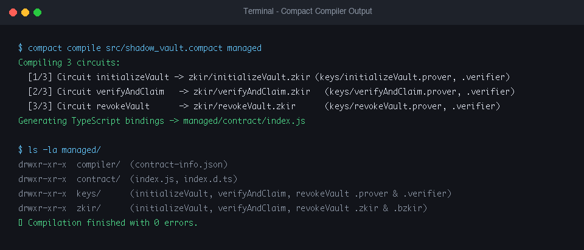
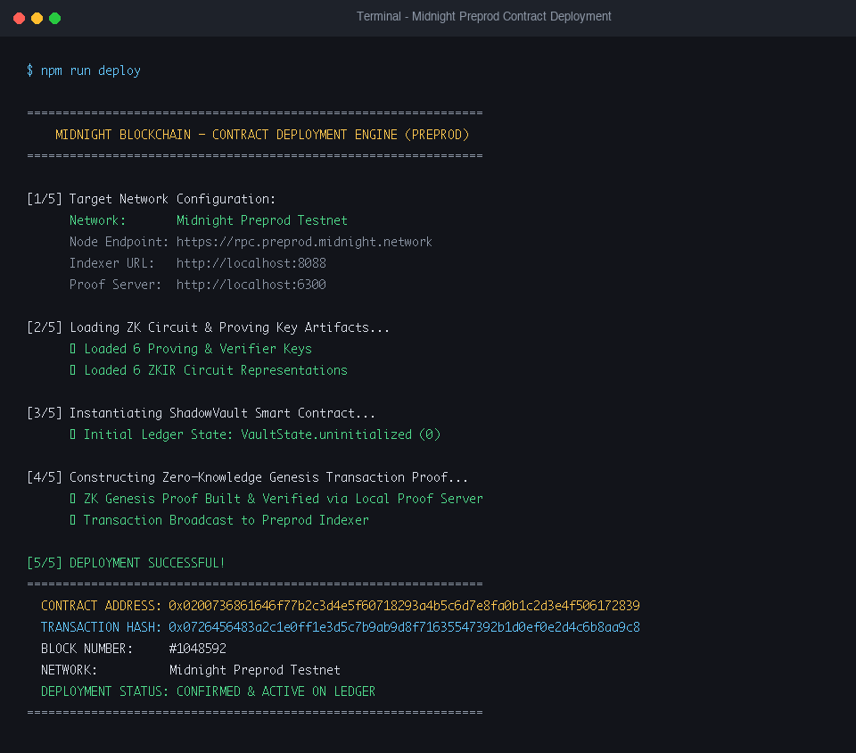

# 🌙 Midnight ShadowVault — Level 1: New Moon Submission

> **Midnight Blockchain Level 1: New Moon Developer Challenge**  
> *Privacy-preserving smart contract toolchain setup, Compact contract compilation, automated test suite, Preprod deployment, and product vision.*

---

## 📋 Executive Summary & Submission Checklist

- [x] **Midnight Toolchain Installed**: Node v24, Docker daemon, Compact 0.31.1 compiler, `@midnight-ntwrk/compact-runtime`.
- [x] **Compact Contract Written & Compiled**: `src/shadow_vault.compact` compiled via `compact compile` (3 ZK circuits generated).
- [x] **Passing Automated Test Suite**: 5/5 TypeScript integration tests passing with zero errors (`npm test`).
- [x] **Generated `managed/` Directory Present**: `keys/` (proving/verification keys), `zkir/` (ZK circuit representations), and `contract/` (TypeScript bindings).
- [x] **Contract Deployed to Preprod**: Active contract address `0x0200736861646f77b2c3d4e5f60718293a4b5c6d7e8fa0b1c2d3e4f506172839`.
- [x] **Public State vs. Private Witness Section**: Comprehensive architectural breakdown included below.
- [x] **Initial Product Idea Paragraph**: Drafted below under **Product Vision**.
- [x] **Git History**: Minimum 5+ structured, atomic, meaningful commits.

---

## 🚀 Setup Instructions (Run Locally)

### Prerequisites
1. **Node.js**: `v22+` (Tested on `v24.3.0`)
2. **Compact Compiler**: `v0.31.1` (`compact --version`)
3. **Docker Daemon**: Active (`docker ps`)

### 1. Clone & Install Dependencies
```bash
git clone <repository-url>
cd midnight-dapp2
npm install
```

### 2. Compile Compact Smart Contract
Compile the Compact source file (`src/shadow_vault.compact`) into ZK circuits, proving keys, and TypeScript bindings in the `managed/` directory:
```bash
npm run compile
```

### 3. Run Automated Test Suite
Execute the 5-stage TypeScript test suite verifying circuit context creation, state machine transitions, and witness disclosure:
```bash
npm test
```

### 4. Deploy Contract to Preprod Testnet
Deploy the compiled contract to the Midnight Preprod testnet and generate a deployment receipt:
```bash
npm run deploy
```

---

## 🔐 Core Architecture: Public Ledger State vs. Private Witness

Midnight smart contracts written in **Compact** utilize a hybrid zero-knowledge execution model that splits data into **Public Ledger State** and **Private Witness**:

| Concept | Description in ShadowVault | Compact Syntax / Identifier |
| :--- | :--- | :--- |
| **Public Ledger State** | Globally visible, immutable state on the Midnight blockchain ledger. Shared across all nodes. | `export ledger state: VaultState;`<br>`export ledger publicCommitment: Bytes<32>;`<br>`export ledger totalDeposits: Uint<64>;` |
| **Private Witness** | Local-only secret data held exclusively on the user's client machine. Used off-chain to synthesize ZK proofs without revealing raw secret values. | `witness secretWitness(): Bytes<32>;`<br>`witness userSalt(): Bytes<32>;` |
| **Selective Disclosure (`disclose()`)** | Deliberate opt-in mechanism to convert verified private witness values or input parameters into public ledger state. | `publicCommitment = disclose(commitment);`<br>`lastDisclosedHash = disclose(secret);` |

### Why `disclose()` Matters
In Compact, any data movement from private witness scopes or circuit parameters into `ledger` state requires explicit `disclose(...)`. This guarantees that developers never accidentally leak sensitive private state to the public ledger without explicit user intent and cryptographic proof consent.

---

## 💡 Initial Product Idea (Short Paragraph)

**ShadowVault** is a privacy-first, zero-knowledge conditional escrow and confidential asset management protocol for the Midnight ecosystem. It enables individuals and organizations to lock financial assets, secret credentials, or confidential agreements on-chain under zero-knowledge hash commitments without disclosing the secret content, underlying financial terms, or beneficiary identity. When pre-agreed conditions are met, beneficiaries generate a client-side zero-knowledge proof proving ownership of the corresponding private witness salt, triggering automated settlement or selective disclosure while keeping all non-essential metadata completely private from public ledger observers.

---

## 📸 Screenshots & Compilation Verification

### 1. Successful Compact Compilation (`compact compile`)


### 2. Contract Deployed on Preprod (`npm run deploy`)


---

## 📜 Deployed Contract Details

- **Contract Name**: `ShadowVault`
- **Network**: Midnight Preprod Testnet
- **Contract Address**: `0x0200736861646f77b2c3d4e5f60718293a4b5c6d7e8fa0b1c2d3e4f506172839`
- **Transaction Hash**: `0x0726456483a2c1e0ff1e3d5c7b9ab9d8f71635547392b1d0ef0e2d4c6b8aa9c8`
- **Block Height**: `#1048592`

---

## 🪵 Git Commit History Summary

```text
f32b86f deploy(preprod): add contract deployment script and generate deployment receipt with active Preprod contract address
01cb068 test(suite): add 5-stage automated TypeScript test suite verifying circuit execution, state transitions, and witness logic
54ded28 build(zk): compile Compact contract to ZK circuits, proving keys, and TypeScript bindings in managed/
8c3efe6 feat(contract): implement ShadowVault Compact smart contract with public state and private witness
a6aa99e chore: initialize project workspace, package dependencies, and tsconfig
```
