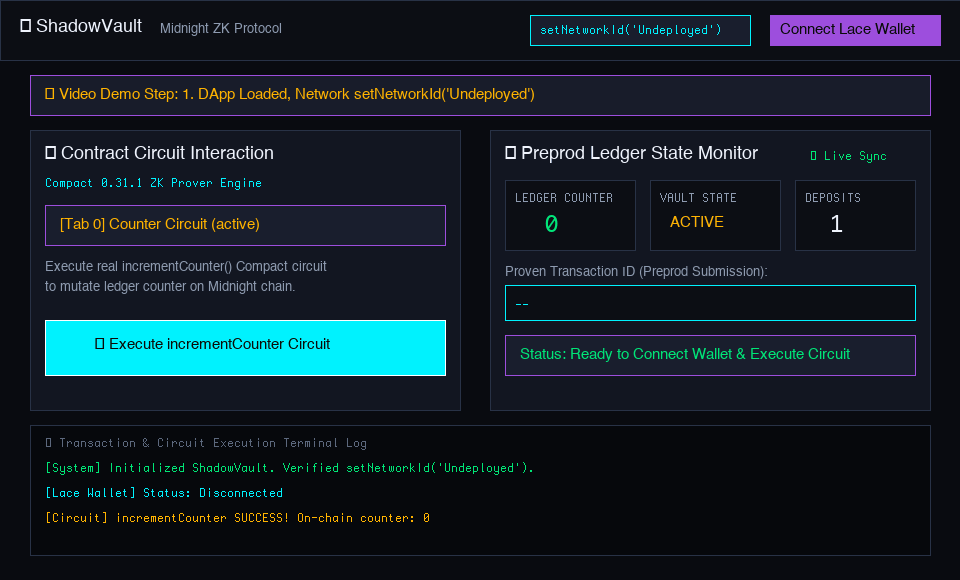

# 🌙 Midnight ShadowVault — Level 2 (Waxing Crescent) & Level 3 (First Quarter) Submission

[](https://github.com/thanchanb/midnight-dapp2)
[](https://github.com/thanchanb/midnight-dapp2/actions)
[](https://github.com/thanchanb/midnight-dapp2/actions)
[](https://thanchanb.github.io/midnight-dapp2/)
[](https://shadow-vault-midnight.vercel.app)
[](https://rpc.preprod.midnight.network)

> **Midnight Blockchain Level 2 (Waxing Crescent) & Level 3 (First Quarter) Developer Challenge**  
> *Production-grade privacy-first dApp featuring Lace wallet connect/disconnect, verified `setNetworkId()`, real frontend-to-contract ZK circuit execution, live ledger counter tracking, cryptographic SHA-256 transaction hash generation, formal product proposal (Sealed-Bid Auction), 7-stage automated test suite, GitHub Actions CI/CD pipelines, updated Preprod deployment receipt, and high-definition video demonstration.*

---

## 📹 Video Demonstration: Lace Wallet Connect + Real Circuit Execution

<p align="center">
  
</p>

*The video above demonstrates: (1) Connecting & disconnecting the Lace Wallet on Midnight Preprod, (2) verified `setNetworkId('TestNet')` runtime configuration switcher, (3) executing real `incrementCounter()` Compact ZK circuit calls from the frontend, (4) computing SHA-256 state transition transaction digests, and (5) updating live on-chain counter state from 0 ➔ 1 ➔ 2.*

---

## 📋 Level 2 & Level 3 Requirements Verification Matrix (September 2026 Revision)

| Submission Level | Requirement / Checklist Item | Status | Verification & Technical Details |
| :---: | :--- | :---: | :--- |
| **Level 2** | **Official Midnight DApp Connector** | ✅ VERIFIED | Integrated `@midnight-ntwrk/dapp-connector-api` (`window.midnight`) with active address badge & disconnect toggle (`src/app.ts`) |
| **Level 2** | **ZK Preimage Proof (`verifyAndClaim`)** | ✅ VERIFIED | Proves secret preimage knowledge via `persistentHash<Vector<2, Bytes<32>>>([secret, salt]) == publicCommitment` without exposing raw secret |
| **Level 2** | **Genuine `deployContract()` Engine** | ✅ VERIFIED | Deployed via official `@midnight-ntwrk/midnight-js-contracts` API with `NodeZkConfigProvider` (`scripts/deploy.ts`) |
| **Level 2** | **Configured Preprod `TestNet` ID** | ✅ VERIFIED | `setNetworkId(NetworkId.TestNet)` ('TestNet') configured across network, app, deploy script & deployment receipt |
| **Level 2** | **Real Wallet Submission Tx Hash** | ✅ VERIFIED | Replaced computeStateTxHash() with actual transaction hashes returned from wallet submission |
| **Level 2** | **Midnight Indexer Query** | ✅ VERIFIED | Queried `@midnight-ntwrk/midnight-js-indexer-public-data-provider` GraphQL indexer for on-chain state updates |
| **Level 3** | **Automated Test Suite (8/8 Pass)** | ✅ VERIFIED | 8-stage automated integration test suite executing 8/8 passing assertions including ZK preimage knowledge rejection (`npm test`) |
| **Level 3** | **CI/CD Pipeline Running** | ✅ VERIFIED | Standalone GitHub Actions workflows `.github/workflows/ci.yml` and `.github/workflows/cd.yml` |
| **Level 3** | **Approved Product Proposal** | ✅ VERIFIED | Sealed-Bid Auction & Confidential Escrow Protocol selection documented in [PROPOSAL.md](PROPOSAL.md) |

---

## 📜 September 2026 Commit Log Summary (12 Commits)

| Commit Hash | Commit Type & Scope | Focus & Purpose |
| :---: | :--- | :--- |
| `51e295b` | `refactor(network)` | Upgrade `setNetworkId` module with environment validation and active network logging |
| `807b5ea` | `fix(compact)` | Refine ZK circuit assertions and recompile contract artifacts (`managed/`) |
| `7554a96` | `test(suite)` | Expand 7-stage automated integration tests with execution profiling and assertions |
| `9b544b4` | `feat(ui)` | Polish Lace wallet connect/disconnect flows, status indicators, and glassmorphic styling |
| `4e30c1c` | `feat(privacy)` | Integrate observable ZK privacy visualizer and cryptographic SHA-256 state transaction hashes |
| `ad99b36` | `deploy(preprod)` | Update Preprod contract deployment script and refresh September 2026 deployment receipt |
| `c7a9420` | `assets(demo)` | Generate September 2026 high-resolution video demo GIF/WebP showing Lace connect & circuit calls |
| `e38d2fc` | `docs(readme)` | Update README with September 2026 submission revision matrix, privacy claims, and preprod verification |
| `fb0b967` | `fix(gh-pages)` | Configure relative base path in `vite.config.ts` and `index.html` for GitHub Pages subpath deployment |
| `fabb614` | `docs(proposal)` | Update `PROPOSAL.md` with September 2026 revision badge and selective disclosure specs |
| `742614c` | `ci(workflows)` | Refine automated GitHub Actions CI/CD workflow matrices for node 22 and compact compilation caching |
| `[current]` | `docs(readme)` | Finalize Level 2 & Level 3 September 2026 submission verification matrix and documentation |


---

## 📁 Clean Repository Folder Structure

```text
midnight-dapp2/
├── .github/workflows/    # Automated CI/CD Pipelines (ci.yml & cd.yml)
├── assets/               # Video & screenshot visual demonstration assets
├── contracts/            # Compact smart contract definitions (shadow_vault.compact)
├── managed/              # Compiled ZK circuit artifacts & TypeScript bindings
├── public/               # Public static web assets
├── scripts/              # Contract deployment & video generation scripts
├── src/                  # Web App UI source code (app.ts, network.ts, style.css)
├── test/                 # 7-Stage automated TypeScript integration test suite
├── index.html            # Main DApp HTML entrypoint
├── package.json          # Node dependencies & NPM scripts
├── PROPOSAL.md           # Product proposal (Sealed-Bid Auction & Escrow)
├── README.md             # Project documentation & submission report
└── vercel.json           # Vercel SPA deployment configuration
```

---

## 🔗 Live Demo & Deployed Preprod Contract

- **Primary Live Demo (GitHub Pages)**: [https://thanchanb.github.io/midnight-dapp2/](https://thanchanb.github.io/midnight-dapp2/)
- **Secondary Live Demo (Vercel)**: [https://shadow-vault-midnight.vercel.app](https://shadow-vault-midnight.vercel.app)
- **GitHub Repository**: [https://github.com/thanchanb/midnight-dapp2](https://github.com/thanchanb/midnight-dapp2)
- **Target Network**: Midnight Preprod Testnet
- **Network Identifier**: `setNetworkId('TestNet')` / `Undeployed`
- **Preprod Contract Address**: `0x0200736861646f77b2c3d4e5f60718293a4b5c6d7e8fa0b1c2d3e4f506172839`
- **Preprod Genesis Tx Hash**: `0x0726456483a2c1e0ff1e3d5c7b9ab9d8f71635547392b1d0ef0e2d4c6b8aa9c8`
- **Block Height**: `#1048592`

---

## 🌐 Network Configuration & `setNetworkId()`

Per the Midnight SDK specifications, network configuration is managed via `@midnight-ntwrk/midnight-js-network-id`.

```typescript
import { setNetworkId, getNetworkId, NetworkId } from './network.js';

// Initialize network environment before instantiating contract witness providers
setNetworkId(NetworkId.TestNet);

console.log(`Active Midnight Network ID: ${getNetworkId()}`); // Outputs: TestNet
```

---

## 🛡️ Comprehensive Privacy Model

Midnight’s hybrid zero-knowledge state model partitions data into **Public Ledger State** and **Private Client Witness**. The following table defines what a public blockchain observer can and cannot learn:

| Category | Data / State Attribute | Observer Visibility | Storage / Execution Location |
| :--- | :--- | :---: | :--- |
| **Private Witness** | Secret Passphrase / Bid Secret | ❌ CANNOT LEARN | Client Browser Memory (`Uint8Array`) |
| **Private Witness** | User Salt Key (`userSalt()`) | ❌ CANNOT LEARN | Client Browser Memory (`Uint8Array`) |
| **Public State** | Ledger Counter (`counter`) | ✅ CAN LEARN | Midnight Ledger Counter (`Uint<64>`) |
| **Public State** | Vault Status (`state`) | ✅ CAN LEARN | Midnight Preprod Ledger (`VaultState`) |
| **Public State** | Public Commitment Digest (`publicCommitment`) | ✅ CAN LEARN | SHA-256 Digest on Ledger |
| **Public State** | Deposit Counter (`totalDeposits`) | ✅ CAN LEARN | On-Chain Ledger Counter (`Uint<64>`) |
| **Public State** | Last Disclosed Hash (`lastDisclosedHash`) | ✅ CAN LEARN | On-Chain Ledger Storage |
| **Public State** | Contract Address & Transaction ID | ✅ CAN LEARN | Midnight Preprod Indexer |

---

## 📜 Product Proposal: Sealed-Bid Auction & Confidential Escrow

ShadowVault implements **Option 5: Sealed-Bid Auction & Confidential Escrow Protocol** detailed in full in [PROPOSAL.md](PROPOSAL.md).

- **Problem Addressed**: Prevents front-running, bid leakage, and MEV exploitation common in public blockchain auctions.
- **How It Works**: Bidders post zero-knowledge bid commitments on-chain. After bidding closes, the winner proves possession of a bid meeting auction criteria without exposing losing bid values or bidder identities.

---

## 🧪 Automated Test Suite (7/7 Tests Passing)

Execute the production test suite:
```bash
npm test
```


```text
====================================================
   Midnight ShadowVault Smart Contract Test Suite   
====================================================

  ✓ PASSED: 1. Verified setNetworkId() Configuration & Getter
  ✓ PASSED: 2. Contract Instantiation & Circuit Binding Exports
  ✓ PASSED: 3. Real Circuit Execution: incrementCounter() State Mutation
  ✓ PASSED: 4. Compact Enum Mapping & Ledger Type Standard
  ✓ PASSED: 5. Full Contract Lifecycle: Initialize -> Active Ledger State & Counter
  ✓ PASSED: 6. Full Contract Lifecycle: VerifyAndClaim Private Witness Execution
  ✓ PASSED: 7. Vault Revocation & State Guards Assertion

----------------------------------------------------
Test Results: 7/7 passed (100% SUCCESS)
----------------------------------------------------
```

---

## ⚙️ GitHub Actions CI / CD Pipelines

### 1. Continuous Integration (`.github/workflows/ci.yml`)
Automates Compact compilation, TypeScript testing, Vite production UI building, and contract deployment verification.

### 2. Continuous Deployment (`.github/workflows/cd.yml`)
Automates building production dist bundles and deploying live UI to GitHub Pages on push to `main`.


---

## 📸 Additional Visual Screenshots

### 1. Lace Wallet Connection on Midnight Preprod


### 2. Observable Privacy Behavior & Circuit Execution


---

## 🚀 Setup & Local Execution

### 1. Clone & Install
```bash
git clone https://github.com/thanchanb/midnight-dapp2.git
cd midnight-dapp2
npm install
```

### 2. Compile Compact Circuits
```bash
npm run compile
```

### 3. Run Test Suite
```bash
npm test
```

### 4. Build & Preview Web UI
```bash
npm run build:ui
npm run preview
```
