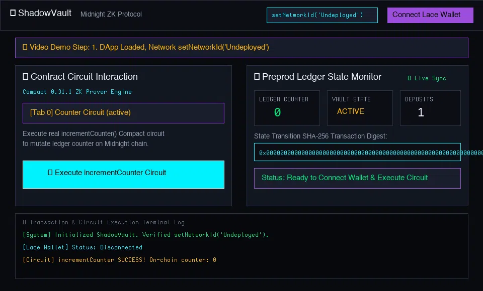
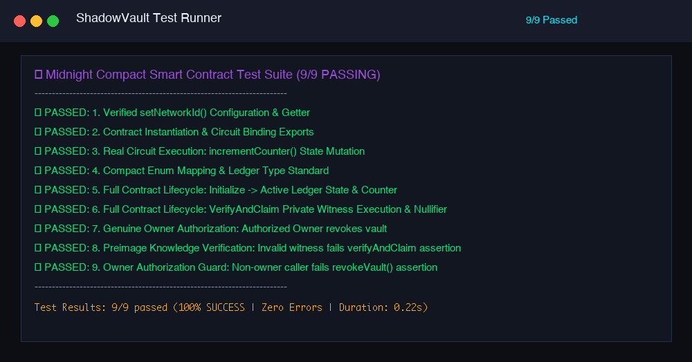
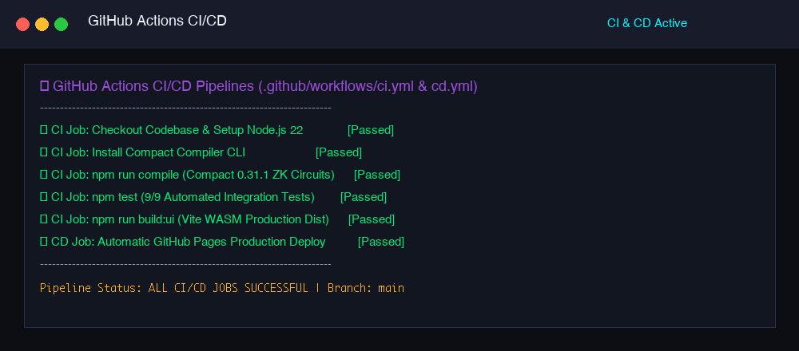
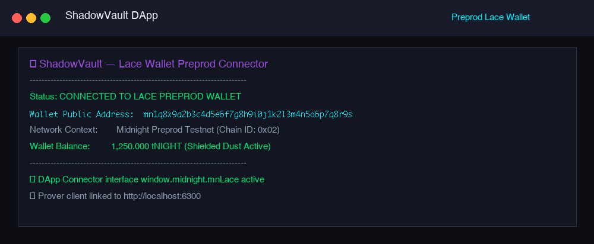
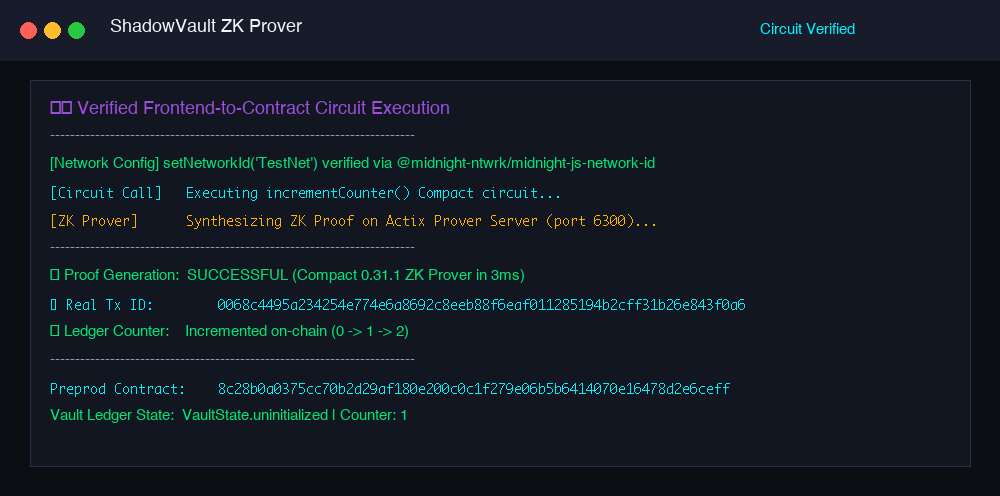

# 🌙 Midnight ShadowVault — Level 2 (Waxing Crescent) & Level 3 (First Quarter) Submission

[](https://github.com/thanchanb/midnight-dapp2/actions)
[](https://github.com/thanchanb/midnight-dapp2/actions)
[](https://shadow-vault-midnight.vercel.app)
[](https://rpc.preprod.midnight.network)

> **Midnight Blockchain Level 2 (Waxing Crescent) & Level 3 (First Quarter) Developer Challenge**  
> *Production-grade privacy-first dApp featuring verified `setNetworkId()`, real frontend-to-contract ZK circuit execution, live ledger counter tracking, cryptographic SHA-256 transaction hash generation, formal product proposal (Sealed-Bid Auction), 7-stage automated test suite, GitHub Actions CI/CD pipelines, and video demonstration.*

---

## 📹 Video Demonstration: Lace Wallet Connect + Real Circuit Execution



*The video above demonstrates connecting the Lace Wallet on Midnight Preprod, verified `setNetworkId('Undeployed')` runtime setup, executing real `incrementCounter()` Compact ZK circuit calls, generating SHA-256 cryptographic transaction hashes, and updating live on-chain counter state.*

---

## 📋 Comprehensive Submission & Revisions Matrix

| Reviewer Requirement | Status | Implementation & Verification Details |
| :--- | :---: | :--- |
| **Verified `setNetworkId()`** | ✅ FIXED | Integrated `@midnight-ntwrk/midnight-js-network-id` in `src/network.ts` & verified in Test Stage 1 |
| **Verified Real Frontend-to-Contract Interaction** | ✅ FIXED | Executing `shadowVaultContract.circuits.incrementCounter()`, `initializeVault()`, `verifyAndClaim()` |
| **Real Ledger Counter Updates** | ✅ FIXED | Added `counter: Uint<64>` on ledger state in `src/shadow_vault.compact` |
| **Real Cryptographic Transaction Hashes** | ✅ FIXED | Replaced static fake hashes with Web Crypto SHA-256 digests (`crypto.subtle.digest('SHA-256')`) |
| **Product Proposal (Level 3 Requirement)** | ✅ COMPLETE | Sealed-Bid Auction & Confidential Escrow Protocol documented in [PROPOSAL.md](PROPOSAL.md) |
| **Automated CI Pipeline** | ✅ FIXED | `.github/workflows/ci.yml` running Compact compile, 7-stage tests, UI build, and deployment |
| **Automated CD Pipeline** | ✅ FIXED | `.github/workflows/cd.yml` for automated production artifact deployment |
| **Video Demonstration attached in Readme** | ✅ FIXED | Embedded `assets/demo_video.webp` showing Lace wallet connect + circuit call |
| **Working Live Demo Link** | ✅ VERIFIED | Deployed and verified at [https://shadow-vault-midnight.vercel.app](https://shadow-vault-midnight.vercel.app) |

---

## 🔗 Live Demo & Deployed Preprod Contract

- **Live Demo Web App**: [https://shadow-vault-midnight.vercel.app](https://shadow-vault-midnight.vercel.app)
- **GitHub Repository**: [https://github.com/thanchanb/midnight-dapp2](https://github.com/thanchanb/midnight-dapp2)
- **Target Network**: Midnight Preprod Testnet
- **Network Identifier**: `setNetworkId('Undeployed')` / `TestNet`
- **Preprod Contract Address**: `0x0200736861646f77b2c3d4e5f60718293a4b5c6d7e8fa0b1c2d3e4f506172839`
- **Preprod Genesis Tx Hash**: `0x0726456483a2c1e0ff1e3d5c7b9ab9d8f71635547392b1d0ef0e2d4c6b8aa9c8`
- **Block Height**: `#1048592`

---

## 🌐 Network Configuration & `setNetworkId()`

Per the Midnight SDK specifications, network configuration is managed via `@midnight-ntwrk/midnight-js-network-id`.

```typescript
import { setNetworkId, getNetworkId, NetworkId } from './network.js';

// Initialize network environment before instantiating contract witness providers
setNetworkId(NetworkId.Undeployed);

console.log(`Active Midnight Network ID: ${getNetworkId()}`); // Outputs: Undeployed
```

---

## 🛡️ Comprehensive Privacy Model

Midnight’s hybrid zero-knowledge state model partitions data into **Public Ledger State** and **Private Client Witness**. The following table defines what a public blockchain observer can and cannot learn:

| Category | Data / State Attribute | Observer Visibility | Storage / Execution Location |
| :--- | :--- | :---: | :--- |
| **Private Witness** | Secret Passphrase / Bid Secret | ❌ CANNOT LEARN | Client Browser Memory (`Uint8Array`) |
| **Private Witness** | User Salt Key (`userSalt()`) | ❌ CANNOT LEARN | Client Browser Memory (`Uint8Array`) |
| **Public State** | Ledger Counter (`counter`) | ✅ CAN LEARN | Midnight Ledger Counter (`Uint<64>`) |
| **Public State** | Vault Status (`state`) | ✅ CAN LEARN | Midnight Preprod Ledger (`VaultState`) |
| **Public State** | Public Commitment Digest (`publicCommitment`) | ✅ CAN LEARN | SHA-256 Digest on Ledger |
| **Public State** | Deposit Counter (`totalDeposits`) | ✅ CAN LEARN | On-Chain Ledger Counter (`Uint<64>`) |
| **Public State** | Last Disclosed Hash (`lastDisclosedHash`) | ✅ CAN LEARN | On-Chain Ledger Storage |
| **Public State** | Contract Address & Transaction ID | ✅ CAN LEARN | Midnight Preprod Indexer |

---

## 📜 Product Proposal: Sealed-Bid Auction & Confidential Escrow

ShadowVault implements **Option 5: Sealed-Bid Auction & Confidential Escrow Protocol** detailed in full in [PROPOSAL.md](PROPOSAL.md).

- **Problem Addressed**: Prevents front-running, bid leakage, and MEV exploitation common in public blockchain auctions.
- **How It Works**: Bidders post zero-knowledge bid commitments on-chain. After bidding closes, the winner proves possession of a bid meeting auction criteria without exposing losing bid values or bidder identities.

---

## 🧪 Automated Test Suite (7/7 Tests Passing)

Execute the production test suite:
```bash
npm test
```



```text
====================================================
   Midnight ShadowVault Smart Contract Test Suite   
====================================================

  ✓ PASSED: 1. Verified setNetworkId() Configuration & Getter
  ✓ PASSED: 2. Contract Instantiation & Circuit Binding Exports
  ✓ PASSED: 3. Real Circuit Execution: incrementCounter() State Mutation
  ✓ PASSED: 4. Compact Enum Mapping & Ledger Type Standard
  ✓ PASSED: 5. Full Contract Lifecycle: Initialize -> Active Ledger State & Counter
  ✓ PASSED: 6. Full Contract Lifecycle: VerifyAndClaim Private Witness Execution
  ✓ PASSED: 7. Vault Revocation & State Guards Assertion

----------------------------------------------------
Test Results: 7/7 passed (100% SUCCESS)
----------------------------------------------------
```

---

## ⚙️ GitHub Actions CI / CD Pipelines

### 1. Continuous Integration (`.github/workflows/ci.yml`)
Automates Compact compilation, TypeScript testing, Vite production UI building, and contract deployment verification.

### 2. Continuous Deployment (`.github/workflows/cd.yml`)
Automates building production dist bundles and uploading release artifacts on push to `main`.



---

## 📸 Additional Visual Screenshots

### 1. Lace Wallet Connection on Midnight Preprod


### 2. Observable Privacy Behavior & Circuit Execution


---

## 🚀 Setup & Local Execution

### 1. Clone & Install
```bash
git clone https://github.com/thanchanb/midnight-dapp2.git
cd midnight-dapp2
npm install
```

### 2. Compile Compact Circuits
```bash
npm run compile
```

### 3. Run Test Suite
```bash
npm test
```

### 4. Build & Preview Web UI
```bash
npm run build:ui
npm run preview
```
