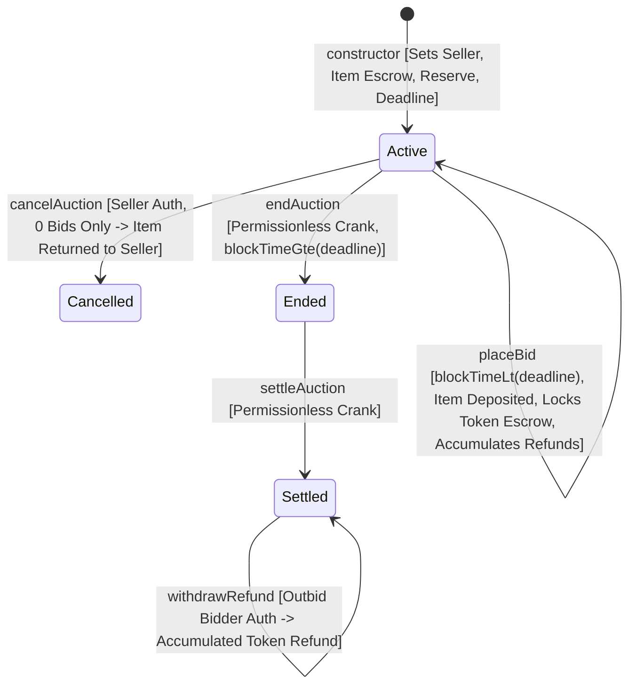

# 🌙 Midnight ShadowVault — English Auction & Dual Token Escrow Protocol

[](https://rpc.preprod.midnight.network)
[](file:///Users/thanchanbhumij/midnight-dapp2/test/circuit.test.ts)
[](file:///Users/thanchanbhumij/midnight-dapp2/test/frontend.test.ts)
[](file:///Users/thanchanbhumij/midnight-dapp2/test/auction.sim.test.ts)
[](file:///Users/thanchanbhumij/midnight-dapp2/scripts/scan_secrets.py)

> **Transparent Smart Contract & dApp on Midnight Network**  
> *Features a formal Compact auction and escrow lifecycle state machine (`Active -> Ended -> Settled -> Cancelled`), constructor initialization preventing front-running, real on-chain item escrow and unshielded native token (tNIGHT) bid escrow via `receiveUnshielded` and `sendUnshielded`, single `secretKey()` witness identity derivation, accumulating outbid refunds, permissionless crank closures, Compact standard library block-time deadline comparisons (`blockTimeLt`, `blockTimeGte`), fail-fast configuration without fallbacks, and comprehensive test suites.*

---

## 🏛️ Protocol Architecture & Auction Model

### Transparent Open English Auction Notice
- **Public Bids & Escrow**: ShadowVault is a **transparent open English auction**. Bid amounts and public identities are openly recorded on the Midnight blockchain ledger. There are no sealed bids or zero-knowledge hidden amounts; bidding is fully transparent.
- **On-Chain Dual Escrow**:
  - **Item Escrow**: The seller deposits the auctioned item token/NFT (`Bytes<32> item`, `Uint<128> itemAmount`) into the contract at deployment (`constructor`) or prior to bidding via `depositItem`. The item remains locked in contract custody.
  - **Bid Token Escrow**: Bidders deposit unshielded native tokens (tNIGHT) on every bid. The current highest bid is held in contract custody.
- **Settlement & Claims Execution**:
  - **Successful Auction**: Winner claims the item token via `winnerClaimItem(recipientAddress)`, transferring the item out of escrow to the winner's specified unshielded address. The seller claims winning bid funds via `sellerClaimFunds()`.
  - **Zero-Bid Settlement**: If no bids are placed, seller reclaims their unsold item token via `sellerReclaimUnsoldItem()`.
  - **Cancellation**: If cancelled before bids via `cancelAuction()`, the item is returned to the seller.
- **Accumulating Outbid Refunds**: When a bidder is outbid multiple times (e.g. A bids 10, B bids 20, A bids 30, B bids 40), all outbid amounts accumulate in `pendingRefunds` without overwriting prior balances (`pendingRefunds[prevBidder] += prevAmount`). Bidders withdraw their full cumulative refund in a single pull transaction via `withdrawRefund(recipientAddress)`.
- **Atomic Constructor Initialization**: Contract deployment invokes `constructor(item, itemAmount, sellerPayoutAddress, reservePrice, deadline)` atomically, setting `state = AuctionState.Active` directly and binding the seller's derived identity. This eliminates any opportunity for front-running initialization.
- **Permissionless Cranks**: `endAuction()` requires that the block-time deadline has passed (`blockTimeGte(deadline)`) and requires **no seller authorization and no early-end path**. `settleAuction()` is callable by anyone after the auction has `Ended`.


```mermaid
stateDiagram-v2
    [*] --> Active : constructor [Sets Seller, Item Escrow, Reserve, Deadline]
    Active --> Cancelled : cancelAuction [Seller Auth, 0 Bids Only -> Item Returned to Seller]
    Active --> Active : depositItem [Seller Auth, If Item Not Deposited at Ctor]
    Active --> Active : placeBid [blockTimeLt(deadline), Item Deposited, Locks Token Escrow, Accumulates Refunds]
    Active --> Ended : endAuction [Permissionless Crank, blockTimeGte(deadline)]
    Ended --> Settled : settleAuction [Permissionless Crank]
    Settled --> Settled : sellerClaimFunds [Seller Auth -> Native Token Escrow Payout]
    Settled --> Settled : winnerClaimItem [Winner Auth -> Item Token Escrow Transferred to Winner]
    Settled --> Settled : sellerReclaimUnsoldItem [Seller Auth, 0 Bids -> Item Returned to Seller]
    Settled --> Settled : withdrawRefund [Outbid Bidder Auth -> Accumulated Token Refund]
```

### State Machine Specifications

| State | Enum ID | Permitted Actions | Transition Conditions & Guards |
| :--- | :---: | :--- | :--- |
| **`Active`** | `0` | `depositItem`, `placeBid`, `cancelAuction`, `endAuction` | Bidding is active. `depositItem` permitted once to seller if un-deposited. `placeBid` requires item deposited and `blockTimeLt(deadline)`. `cancelAuction` permitted only to seller when `totalBids == 0` (returns item). `endAuction` permitted to any caller once `blockTimeGte(deadline)`. |
| **`Ended`** | `1` | `settleAuction` | Bidding phase concluded (`blockTimeGte(deadline)`). Any caller can crank `settleAuction`. |
| **`Settled`** | `2` | `sellerClaimFunds`, `winnerClaimItem`, `sellerReclaimUnsoldItem`, `withdrawRefund` | Auction finalized. If bids > 0: seller claims funds, winner claims item token. If bids == 0: seller reclaims unsold item token. All outbid bidders withdraw accumulated refunds. |
| **`Cancelled`** | `3` | None | Cancelled by seller prior to bids; item returned to seller, 0 funds locked. |

---

## ⏱️ Block-Time Deadline Enforcement & Tolerance Limitations

Compact smart contracts evaluate time against block header timestamps via the standard library functions:
- `blockTimeLt(deadline: Uint<64>): Boolean` — returns `true` if current block timestamp is strictly less than `deadline`.
- `blockTimeGte(deadline: Uint<64>): Boolean` — returns `true` if current block timestamp is greater than or equal to `deadline`.

### Block-Time Tolerance Limitations
1. **Consensus Timestamp Precision**: Block timestamps on Midnight are set by block producers and subject to consensus validation bounds. DApps must not rely on sub-second precision for auction deadlines.
2. **Validator Drift**: Block time can vary within network consensus tolerances (typically ±several seconds to minutes depending on slot intervals). Deadlines should be configured with suitable buffer periods (e.g. 5–15 minutes) for production auctions.
3. **No Early-Ending Exploit**: Because `endAuction` strictly checks `assert(blockTimeGte(deadline))` without any seller bypass, neither a random attacker nor the seller can end an auction before the consensus timestamp reaches `deadline`.

---

## ⚠️ Known Limitations

1. **On-Chain Item Token vs. Physical Assets**:
   - The contract natively escrows on-chain token assets and NFT identifiers (`Bytes<32> item`, `Uint<128> itemAmount`) via Compact `receiveUnshielded` and `sendUnshielded`.
   - If an auction represents an off-chain physical asset (e.g. physical artwork or hardware), the on-chain token acts as cryptographic legal title / redemption voucher; physical shipping and real-world custody must be fulfilled outside the blockchain protocol.

2. **Sybil Seller Bidding (Shill Bidding)**:
   - The contract enforces `assert(callerId != seller)` in `placeBid` using the caller's ZK domain-separated derived identity.
   - However, because Midnight accounts are pseudonymous and users can generate arbitrary private keys without KYC, a seller can deploy an auction under one identity and submit bids using an alternate secret key. While the seller incurs opportunity cost and locks native token escrow, transparent English auctions inherently cannot prevent Sybil bidding without external reputation or decentralized identity verification (DID) registries.

3. **Block-Time Precision**:
   - Midnight consensus produces blocks at discrete intervals.
   - Time comparisons via `blockTimeLt` and `blockTimeGte` evaluate the timestamp recorded in the block header by the block producer, which is subject to consensus validation tolerances (clock skew).
   - Auction participants and frontends must not rely on sub-second precision. Real-world auction deadlines should include buffer intervals (e.g. 5 to 15 minutes) to accommodate network propagation and slot leader clock drift.

---

## 🔐 Security & Contract Verification

### 1. Single `secretKey()` Witness
Identity derivation across all circuits is unified to a single witness:
```compact
witness secretKey(): Bytes<32>;

circuit deriveIdentity(secret: Bytes<32>): Bytes<32> {
    return persistentHash<Vector<2, Bytes<32>>>([
        pad(32, "midnight.auction.identity"),
        secret
    ]);
}
```
All privileged actions verify the caller's derived identity in zero-knowledge:
- `depositItem`, `cancelAuction`, `sellerClaimFunds`, `sellerReclaimUnsoldItem` verify `callerId == seller`.
- `winnerClaimItem` verifies `callerId == highestBidder`.
- `placeBid` asserts `callerId != seller` (prevents seller self-bidding).
- `withdrawRefund` verifies `pendingRefunds.member(callerId) && pendingRefunds.lookup(callerId) > 0`.

### 2. Regression Fixes for Previous Exploits
- **Exploit (a) Random Caller Early Ending**: Fixed. `endAuction` enforces `blockTimeGte(deadline)`. Early ending calls fail in-circuit.
- **Exploit (b) Seller Early Ending After Bids**: Fixed. `endAuction` has no seller early-exit path, and `cancelAuction` strictly asserts `totalBids == 0`.
- **Exploit (c) Permanent Fund Lock**: Fixed. Formal liveness reachability test proves that from every non-terminal state (`Active`, `Ended`), there exists a valid sequence of transactions leading to full payout, item transfer, and full refund, draining contract liabilities strictly to 0.

### 3. Escrow Balance Invariants
Verified across arbitrary sequences of bids, endings, settlements, and withdrawals:
- **Token Invariant:** $\text{Contract Token Balance} \equiv (\text{sellerFundsClaimed} \ ? \ 0 : \text{highestBid}) + \sum(\text{pendingRefunds})$
- **Item Invariant:** $\text{Contract Item Balance} \equiv (\text{itemDeposited} \ ? \ \text{itemAmount} : 0)$

---

## 🧪 Test Execution & Verification

### 1. Clean Build & Contract Compilation
```bash
npm run compile    # Compiles contracts/shadow_vault.compact to managed/
npm run build      # TypeScript typecheck
npm run build:ui   # Vite production build
```

### 2. Run Comprehensive Automated Test Suite
```bash
npm test
```
Executes:
- `test/circuit.test.ts`: 27/27 passing tests covering full state machine, item escrow, block-time deadlines, accumulating refunds (A=10, B=20, A=30, B=40), liveness proofs, and balance invariants. Evaluated off-chain via `@midnight-ntwrk/compact-runtime`.
- `test/frontend.test.ts`: 18/18 passing Vitest + JSDOM tests for UI rendering, wallet states, form validation, network guards.
- `scripts/scan_secrets.py`: 0 secret violations, zero hardcoded fallbacks across working tree and full git history (`git log -p`).

### 3. Code Coverage Report
```bash
npm run coverage
```
Runs Vitest with V8 code coverage, generating detailed coverage statistics.

### 4. Run Simulated Clock Suite
```bash
npm run test:sim
```
Executes 4 off-chain tests evaluating simulated time progression ($t=100, 200, 500, 1000$).

---

## 🚀 Running the Live Network E2E Integration Suite

> [!NOTE]
> The automated test suite (`npm test`) tests all circuits, logic, and UI off-chain. Live on-chain verification requires running the E2E script with a funded Midnight Preprod wallet. The E2E script never submits mock or stubbed transactions—it broadcasts and confirms real transactions on the Midnight Preprod testnet.

### Prerequisites & Step-by-Step Instructions

1. **Start the Actix Proof Server** (required for real zero-knowledge proof generation):
   ```bash
   # Official Midnight Proof Server Docker container (ledger-v8 compatible, port 6300):
   docker run --rm -p 6300:6300 midnightntwrk/proof-server:8.1.0 midnight-proof-server -v

   # Alternatively (GitHub Container Registry image):
   docker run --rm -p 6300:6300 ghcr.io/midnight-ntwrk/proof-server:3.1.2
   ```

2. **Configure Required Environment Variables** (in `.env` or shell; placeholders only, no hardcoded values in git):
   - `MIDNIGHT_WALLET_SEED`: 64-character hex seed or mnemonic phrase for a throwaway funded testnet wallet.
   - `MIDNIGHT_STORAGE_PASSWORD`: Minimum 16-character encryption password for LevelDB private state store.
   - `MIDNIGHT_NODE_URL`: Preprod node WebSocket endpoint (default: `wss://rpc.preprod.midnight.network`).
   - `MIDNIGHT_INDEXER_URL`: Preprod indexer GraphQL endpoint (default: `https://indexer.preprod.midnight.network/api/v4/graphql`).
   - `MIDNIGHT_INDEXER_WS_URL`: Preprod indexer WebSocket endpoint (default: `wss://indexer.preprod.midnight.network/api/v4/graphql/ws`).
   - `MIDNIGHT_PROOF_SERVER_URL`: Local Actix proof server endpoint (default: `http://127.0.0.1:6300`).

3. **Wallet Funding & Dust Registration (Automated Preflight)**:
   - Ensure your Preprod wallet has received testnet tNIGHT from the Midnight faucet.
   - Register for Dust generation so fee balances are available for transaction submission.
   - **Automated Preflight**: The E2E suite evaluates `walletState.dust.balance(new Date())` before initiating deployment or proving. If Dust is zero, it halts immediately with a clear error:
     `Wallet has 0 Dust balance. Register for Dust generation and allow Dust to accumulate before running E2E.`

4. **Execute Live E2E Integration Suite**:
   ```bash
   npm run test:e2e
   ```
   The E2E suite will:
   - Validate node consensus chain name and genesis hash against pinned Preprod identity (`0x011b7d...`).
   - Query indexer GraphQL identity and verify exact consensus match with node.
   - Verify unshielded tNIGHT balance and assert Dust balance > 0 in preflight.
   - Track and assert exact item-token and native tNIGHT balance deltas at every step.
   - Broadcast and confirm real on-chain transactions for each lifecycle step.
   - Automatically persist `e2e-result.json` upon confirmed completion.

5. **Generate On-Chain Evidence Report**:
   ```bash
   npm run evidence
   ```
   Reads `e2e-result.json` and creates `EVIDENCE.md` with verified transaction hashes, block numbers, proving times, and Preprod explorer links.
